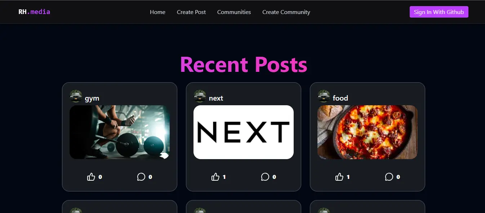

<div align="center">
   <h3 align="center">RH.media — Social Media  WebApp</h3>
  <br />
    <a href="https://social-media-dun-nine.vercel.app/" target="_blank">
      
    </a>
  <br />

  <div>
    
    
   <br/>
    
   
   
  </div>   
  <a href="https://social-media-dun-nine.vercel.app/" target="_blank">
      
    </a>
</div>

## 📋 <a name="table">Table of Contents</a>

1. ✨ [Introduction](#introduction)
2. 🛠 [Tech Stack](#tech-stack)
3. 🚀 [Features](#features)
4. 🤸 [Quick Start](#quick-start)

 


## <a name="introduction">✨ Introduction</a>

A social media application featuring post and community creation with real-time social interactions. Built with a focus on seamless updates and dynamic user engagement.


## <a name="tech-stack">🛠 Tech Stack</a>

- **[Vite](https://vite.dev)** is a next-generation frontend tool that provides an extremely fast development experience. It leverages native browser ES modules and a highly optimized build process to ensure instantaneous Hot Module Replacement (HMR) and superior performance.

- **[React](https://react.dev)** is a declarative, efficient, and flexible JavaScript library for building component-based user interfaces. It enables developers to create complex, high-performance web applications with a seamless developer experience and a robust ecosystem.

- **[TailwindCSS](https://tailwindcss.com/)** is a utility-first CSS framework that allows developers to build custom, responsive designs quickly without leaving their HTML. It provides pre-defined classes for layout, typography, colors, and more.

- **[TypeScript](https://www.typescriptlang.org/)** is a statically typed superset of JavaScript that improves code quality, tooling, and error detection. It is ideal for building large-scale applications and enhances maintainability.

- **[Supabase](https://supabase.com)** is an open-source Firebase alternative that provides a full suite of backend services. It offers a scalable PostgreSQL database, real-time subscriptions, secure authentication, and simplified edge functions, all accessible through a seamless API.
  
- **[GitHub](https://github.com)** is a developer platform that allows developers to create, store, manage, and share their code. It utilizes Git for version control, enabling seamless collaboration, automated workflows via GitHub Actions, and efficient project management for teams of all sizes.


## <a name="features">🚀 Features</a>

👉 **GitHub Authentication**: Secure and seamless user onboarding using GitHub OAuth, leveraging Supabase Auth for identity management.

👉 **Community Management**: 
     **Create Communities**: Users can establish new spaces for specific interests.<br/>
     **Discover Communities**:Browse and join existing communities to interact with like-minded users.
     
👉 **Interactive Feed**: 
     **Engagement System**: Robust Like and Dislike (Upvote/Downvote) functionality for posts.<br/>
     **Nested Comments**: Engage in deep discussions with a structured and intuitive commenting system.<br/>
     **Real-time Updates**: Experience live interactions (likes, comments, and new posts) without page refreshes.
     
👉 **Responsive Design**: A fully optimized UI for mobile, tablet, and desktop views using Tailwind CSS.


## <a name="quick-start">🤸 Quick Start</a>

Follow these steps to set up the project locally on your machine.

**Prerequisites**

Make sure you have the following installed on your machine:

- [Git](https://git-scm.com/)
- [Node.js](https://nodejs.org/en)
- [npm](https://www.npmjs.com/) (Node Package Manager)

**Cloning the Repository**

```bash
git clone https://github.com/rezaHosseini98/Social-media.git
cd Social-media
```

**Installation**

Install the project dependencies using npm:

```bash
npm install
```

**Set Up Environment Variables**

Create a new file named `.env` in the root of your project and add the following content:

```env
#SUPABASE
VITE_SUPABASE_KEY=
VITE_SUPABASE_URL=your_project_url
```

Replace the placeholder values with your real credentials. You can get these by signing up at: [**Supabase**](https://supabase.com/)

**Running the Project**

```bash
npm run dev

```

Open [http://localhost:5173](http://localhost:5173) in your browser to view the project.


